# IoT-system based on Raspberry PI with Sense Hat shield

This app is an user interface for controlling and supervising a SenseHat sensor module for RapsberryPi microcontroller. Matrix/Leds tabs allow the user to set specified colors to each of the LEDs. Charts tab allows to see the sensors readings in real time. Its subtabs allow to view one chart at the time. Data tab allows to view a log of all of the sensors readings in a digestible format. Settings tab allows to adjust basic app options.

IoT system including:
- Raspberry PI with SenseHat shield
- PHP server with REST
- Web app (React)
- Desktop app (Electron)
- Mobile app (Android)

Project created in collaboration with:
- [Patryk Borowski](https://github.com/boobel)
- [Szymon Smodlibowski](https://github.com/MusePL)

# Project tasks
:heavy_check_mark: - server PHP with use of Lighttpd, REST architecture with GET and PUT requests to use all possible inputs/outputs of SenseHat

  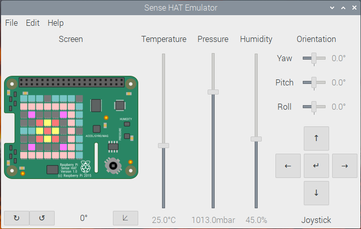

:heavy_check_mark: - Web app with requests to server with possibility to change/get all data on SenseHat

  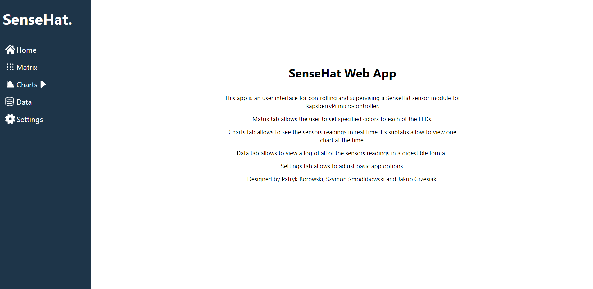
  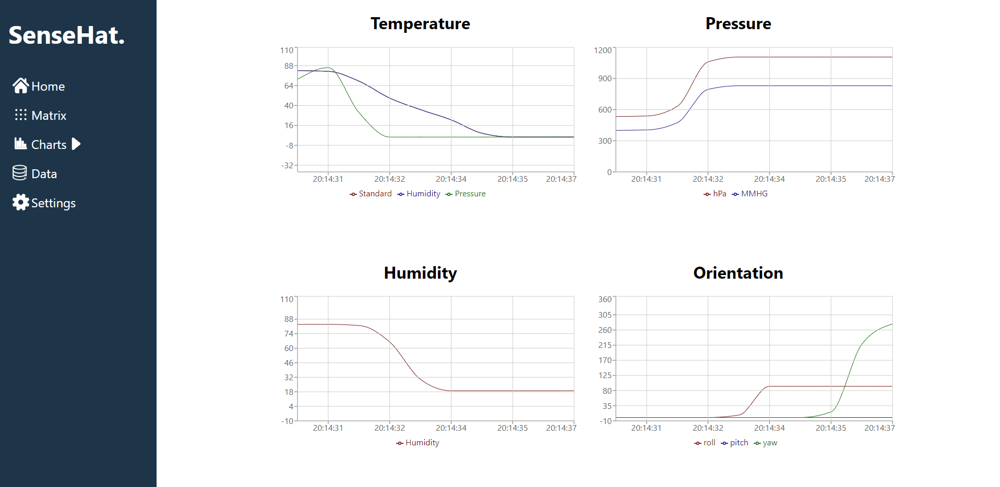
  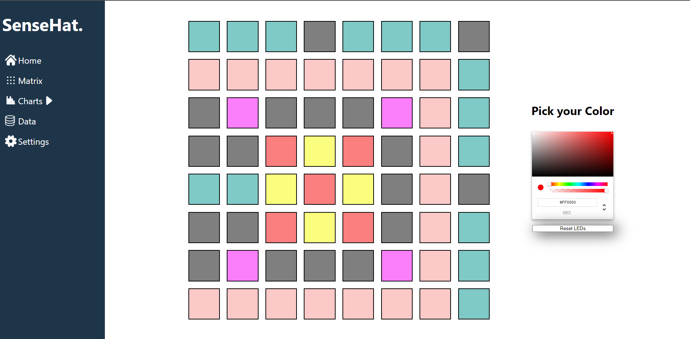
  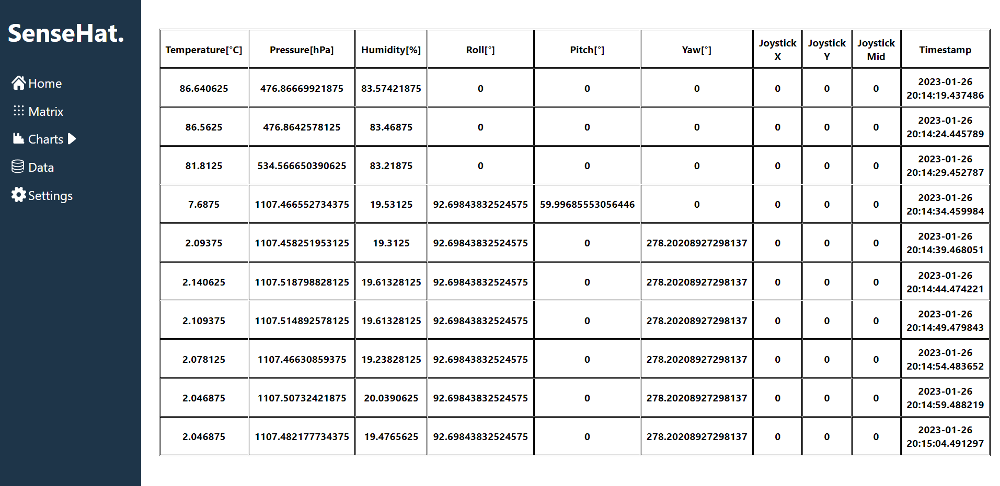
  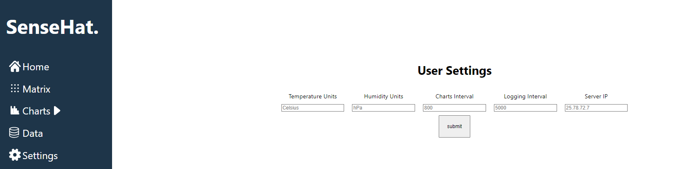

:heavy_check_mark: - Desktop app based on web app with the same UI and functionalities

  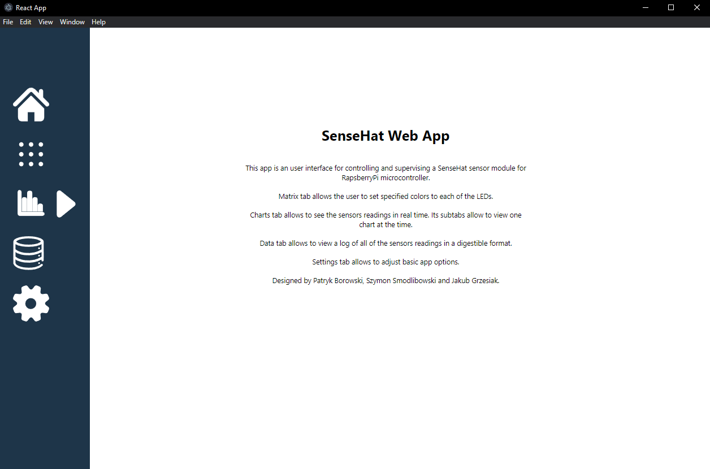

:heavy_check_mark: - Mobile app with similar UI and functionalities as web and desktop app 

   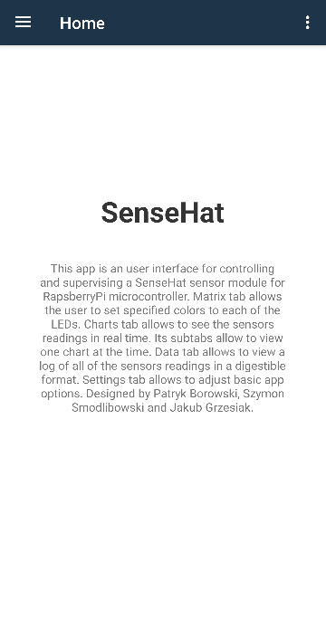 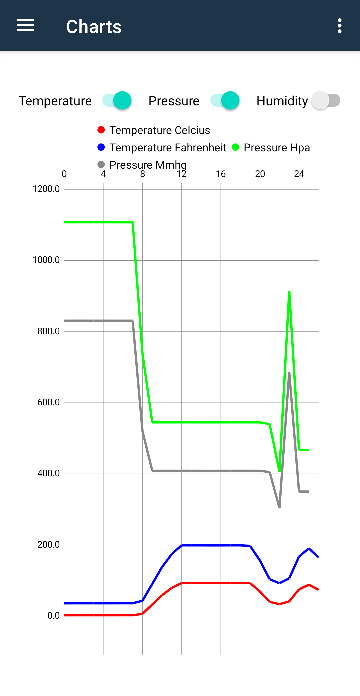 

   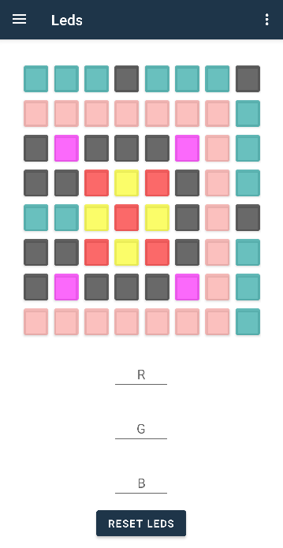 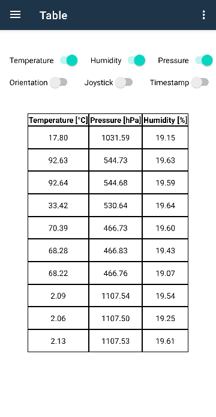 
   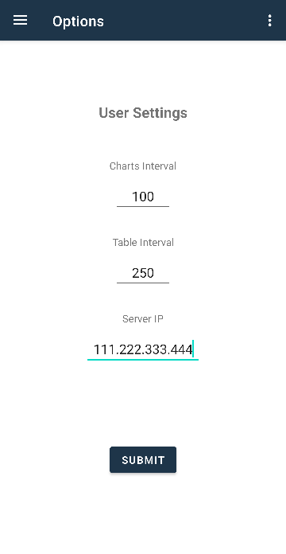

  
  
  

